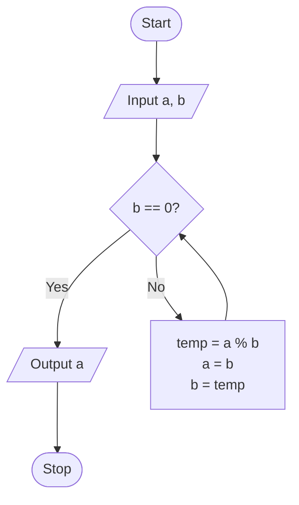
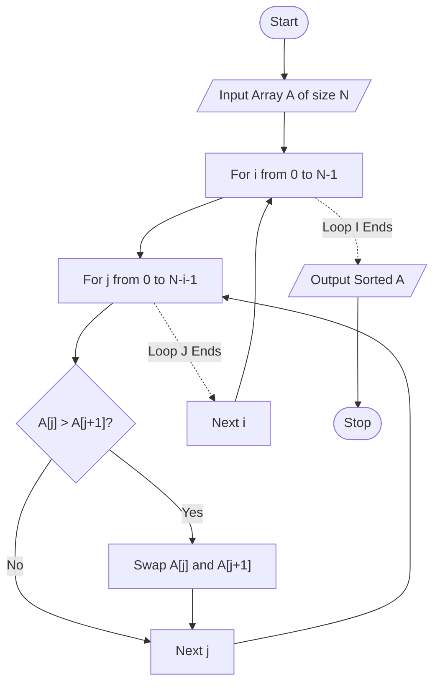

# Analysis of Algorithms (AOA) Lab

This repository contains lab assignments and implementations for the Analysis of Algorithms (AOA) course.

## Contents

- **Lab 1**: Implementation of Iterative and Numeric Algorithms
  - Contains detailed implementations in Python using Jupyter Notebook (`1.ipynb`).
  - Algorithms covered:
    1. GCD (Euclid's Algorithm)
    2. Fibonacci Series
    3. Sequential Search
    4. Bubble Sort
    5. Insertion Sort
    6. Selection Sort
    7. Chinese Remainder Theorem (CRT)
    8. Fermat's Primality Test
    9. Miller-Rabin Test

---

## 📊 Flowcharts

*(Note: GitHub's built-in Jupyter viewer does not render Mermaid flowcharts inside `.ipynb` files. They are provided here for easy viewing).*

### GCD (Euclidean Algorithm) Flowchart


### Bubble Sort Flowchart (Conceptual)


---

## Getting Started

1. **Clone the repository:**
   ```bash
   git clone https://github.com/suyog31/AOA_Lab.git
   cd AOA_Lab
   ```

2. **Run the Jupyter Notebook:**
   ```bash
   jupyter notebook lab1/1.ipynb
   ```
